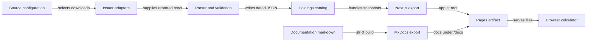

# Architecture

The app performs calculations in the browser. A scheduled build downloads and validates issuer data, exports the app, builds documentation, and deploys one static artifact.

## Overview

Issuer data and documentation converge in the same Pages deployment:



## Components

### Issuer download and discovery

`src/lib/issuer-sources.ts` handles Vanguard Canada, BMO dated downloads, and iShares metadata. Generic downloads and bounded HTML discovery cover compatible files/pages. No browser automation or server-side request runs when a visitor searches.

### Parsing and validation

`src/lib/parse/` handles CSV, XLSX, and table metadata. `ImportSchema` validates the resulting dates, identifiers, nonzero signed weights, and net total. Totals above 100% and up to 100.5% are corrected proportionally to 100%; larger overruns are rejected. Partial tables remain partial.

### Static catalog

`scripts/refresh-catalog.ts` orchestrates updates. It writes files atomically and writes the catalog last. Per-source failures retain previous data. Same-date equal holdings hashes are deduplicated. Corrected same-date content replaces that file.

### Browser calculations

`catalog-client.ts` fetches bundled JSON with the build-time prefix. `components/api.ts` preserves internal helper paths such as `/api/etfs` as local lookups. They are not deployed HTTP API routes.

`calc.ts` groups security contributions by ISIN when available, otherwise by ticker/identifier. It sums amount multiplied by weight divided by 100.

### Documentation

`mkdocs.yml` inherits the shared design system. The combined workflow builds into `out/docs` after Next.js creates `out`. One deployment preserves both sites.

## Data flow

A visitor searches the downloaded catalog, selects a fund, and fetches its latest snapshot. The calculator applies entered amounts locally. Historical snapshot selection reads another static file.

For a maintainer, `npm run refresh` loads all sources and prior snapshots, downloads each source, validates rows, persists valid changes, and records errors. It does not delete ETFs when a source disappears from configuration.

## Directory layout

```text
config/sources.json          Maintained source links
src/lib/issuer-sources.ts    Issuer adapters
src/lib/static-refresh.ts   Refresh and history rules
src/lib/parse/              Holdings parsing
src/lib/calc.ts             Exposure calculation
src/app/                   Static application pages
public/data/               Committed catalog and snapshots
docs/                      Documentation source
mkdocs.yml                 Inherited docs configuration
scripts/stage-docs.mjs      Generated design-system staging
.github/workflows/docs.yml  One app/docs deployment
```

## Design decisions

JSON replaces the former shared PostgreSQL database. It removes runtime hosting and makes data history reviewable in Git. Personal amounts never enter the refresh pipeline.

The calculator does not recursively expand ETFs that hold other ETFs. A source must supply underlying holdings to show that level of exposure. See [Limitations](./roadmap.md).
